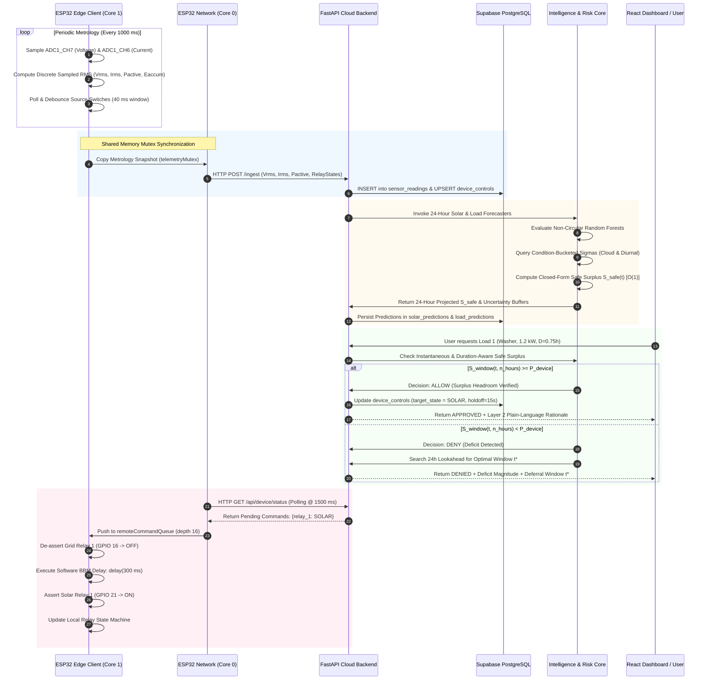

# Phase 3: Master System Architecture and Dataflow Topology

**Document ID:** `Paper/03_Research_Questions_and_Methodology/system_architecture.md`  
**Phase:** Phase 3 — Research Questions, System Architecture & Mathematical Formulation  
**Target Publication:** IEEE Two-Column Journal Manuscript  
**Paper Title:** *"Risk-Aware and Explainable AI for Solar-Integrated Residential Energy Management Under Forecast Uncertainty: An IoT-Enabled Framework"*  
**Authoritative Baseline:** `Project_Report/final_report/` (Chapters 2, 4) and `docs/audit/`  

---

## 1. Architectural Overview & Design Philosophy

The **Solar-Aware Home Energy Management System (HEMS)** is engineered as a distributed, cyber-physical computing framework operating across four coordinated tiers. It unites high-frequency embedded metrology at the physical edge with machine learning forecasting, game-theoretic explainability, closed-form statistical uncertainty quantification, and secure cloud orchestration.

```
┌─────────────────────────────────────────────────────────────────────────────┐
│                 THE FOUR-TIER CYBER-PHYSICAL ARCHITECTURE                   │
├──────────────────────────────────┬──────────────────────────────────────────┤
│ TIER 1: PHYSICAL EDGE CLIENT     │ TIER 3: INTELLIGENCE & RISK CORE         │
│ • Dual-Core ESP32 (Xtensa LX6)   │ • Non-Circular Dual Random Forests       │
│ • Sampled RMS Burst (Core 1)     │ • TreeSHAP Exact Attributions (Layer 1)  │
│ • 8-Relay Matrix + 300ms Delay   │ • Closed-Form Safe Surplus (O(1))        │
├──────────────────────────────────┼──────────────────────────────────────────┤
│ TIER 2: CLOUD MIDDLEWARE         │ TIER 4: VISUALIZATION & ADVISORY         │
│ • FastAPI Asynchronous REST      │ • Supabase PostgreSQL (Row-Level Security)│
│ • Upstream Weather Resilience    │ • React/Vite Real-Time Dashboard         │
│ • Cooldown & Negative TTL Cache  │ • SolarMate AI Read-Only Advisory Gate   │
└──────────────────────────────────┴──────────────────────────────────────────┘
```

The system design adheres to five core architectural principles:
1. **Concurrency Decoupling:** Isolating high-frequency analog metrology from asynchronous network latency using FreeRTOS hardware core pinning.
2. **Computational Edge-Feasibility:** Formulating uncertainty quantification and appliance admission in closed algebraic form ($O(1)$ arithmetic complexity), completely eliminating commercial desktop optimization solvers (MILP/MINLP).
3. **Decoupled Explainability:** Separating model-level game-theoretic feature attributions (TreeSHAP) from system-level appliance control causality to maintain mathematical auditability without confusing residential homeowners.
4. **Architectural Safety Boundaries:** Enforcing a strict read-only advisory boundary for conversational AI assistants, denying Large Language Models any direct relay actuation authority.
5. **Fail-Safe Transfer Switching:** Enforcing a software blocking delay (`delay(300)`) between relay bank transitions to prevent line-to-line AC cross-conduction between unsynchronized mains and inverter sources.

---

## 2. Four-Tier Master Architecture Specification

```
                                [ TIER 4: VISUALIZATION & ADVISORY ]
  ┌─────────────────────────────────────────────────────────────────────────────────────────┐
  │  React 18 / TypeScript Web Dashboard                 SolarMate Conversational AI        │
  │  • Real-Time Metrology Telemetry Streaming           • Groq Llama-3.3-70B API Engine    │
  │  • 24-Hour Safe Surplus & Lookahead Schedule         • Read-Only Tool-Calling Introspect│
  │  • Manual Relay Toggle Overrides & Admin RBAC        • Zero Relay Actuation Authority   │
  └───────────────────────────────┬───────────────────────────────────┬─────────────────────┘
                                  │ HTTPS REST / WSS                  │ Tool JSON Schema
                                  ▼                                   ▼
  ┌─────────────────────────────────────────────────────────────────────────────────────────┐
  │  Supabase Cloud Database (PostgreSQL 15)                                                │
  │  • sensor_readings (1s-3s telemetry)         • device_controls (reconciliation holdoff) │
  │  • solar_predictions & load_predictions      • profiles (quarantine-by-default RBAC)    │
  │  • device_requests (admission audit logs)    • chat_messages (Row-Level Security)       │
  └───────────────────────────────▲─────────────────────────────────────────────────────────┘
                                  │ SQL / PostgREST
                                  ▼
                                [ TIER 2: CLOUD MIDDLEWARE ]
  ┌─────────────────────────────────────────────────────────────────────────────────────────┐
  │  FastAPI Asynchronous Backend (Python 3.10 / Uvicorn ASGI)                              │
  │  • Ingestion Service (POST /ingest)          • Status Polling (GET /api/device/status)  │
  │  • Prediction Service (POST /predict)        • Decision Service (POST /risk)            │
  │  • Explanation Service (POST /xai/explain)   • SolarMate Chat Service (POST /chat)      │
  │  • Weather Cache Engine: Negative TTL, Exponential Cooldown, 429 Rate-Limit Resilience  │
  └───────────────────────────────▲───────────────────────────────────▲─────────────────────┘
                                  │                                   │
                                  │ Local Memory Inference            │ Weather Reanalysis Data
                                  ▼                                   ▼
  ┌──────────────────────────────────────────────┐  ┌───────────────────────────────────────┐
  │  [ TIER 3: INTELLIGENCE & RISK CORE ]        │  │  External Upstream Services           │
  │  • Solar Model: Non-Circular RF (R²=0.9547)  │  │  • Open-Meteo Historical Archive      │
  │  • Load Model: Autoregressive RF (R²=0.5929) │  │    (ERA5-Land Atmospheric Data)       │
  │  • TreeSHAP Explainer (Exact Additivity)     │  │  • Groq Cloud LLM Inference API       │
  │  • Heteroskedastic Safe Surplus Engine (O(1))│  └───────────────────────────────────────┘
  └──────────────────────────────────────────────┘
                                  ▲
                                  │ HTTPS REST (POST /ingest @ 3s; GET /api/device/status @ 1.5s)
                                  ▼
                                [ TIER 1: PHYSICAL EDGE CLIENT ]
  ┌─────────────────────────────────────────────────────────────────────────────────────────┐
  │  ESP32 DevKit V1 Microcontroller (Dual-Core Xtensa LX6 @ 240 MHz, 520 KB SRAM)           │
  │  ┌─────────────────────────────────────────┐   ┌─────────────────────────────────────┐  │
  │  │ CORE 1: METROLOGY & CONTROL (Priority 1)│   │ CORE 0: TELEMETRY & COMMS (Pri 1)   │  │
  │  │ • 1000 ms Meter Sampling Loop           │   │ • 3000 ms Telemetry Transmission    │  │
  │  │ • ZMPT101B Sampled RMS Voltage (ADC1_CH7│◄──│ • 1500 ms Device Status Polling     │  │
  │  │ • ACS712-20A Sampled RMS Current(ADC1_CH│Queue│ • Wi-Fi STA / SmartProv SoftAP AP  │  │
  │  │ • 4-Ch Switch Debounce (40 ms window)   │Mutex│ • NVS Flash Credentials Storage     │  │
  │  │ • 8-Relay Bank Transfer (300 ms Delay)  │──►│ • FreeRTOS Thread Synchronization   │  │
  │  └────────────────────┬────────────────────┘   └─────────────────────────────────────┘  │
  └───────────────────────┼─────────────────────────────────────────────────────────────────┘
                          │ Physical GPIO Switching & Analog Conditioning
                          ▼
  ┌─────────────────────────────────────────────────────────────────────────────────────────┐
  │  Physical Sensor & Actuator Hardware Transducers                                        │
  │  • ZMPT101B Voltage Transformer (AC Mains 230V -> 1.65V DC Bias -> ADC1_CH7 / GPIO 35)  │
  │  • ACS712-20A Hall-Effect Sensor (10k/15k Resistor Divider alpha=0.600 -> GPIO 34)      │
  │  • DHT22 Temperature & Humidity Sensor (1-Wire Protocol -> GPIO 4)                      │
  │  • 8-Channel Relay Matrix: 4 Grid Coils (GPIO 16-19) & 4 Solar Coils (GPIO 21-23, 13)  │
  │  • 4-Channel Source-Selector Toggle Switches (Hardware Debounced -> GPIO 25, 26, 27, 14)│
  │  • Domestic Appliance Loads: Load 1 (Washer), Load 2 (Pump), Load 3 (Fridge), Load 4    │
  └─────────────────────────────────────────────────────────────────────────────────────────┘
```

---

## 3. Tier-by-Tier Technical Breakdown

### 3.1 Tier 1: Embedded Edge Client (ESP32 FreeRTOS Hardware)

The physical computing node is built on an **ESP32 DevKit V1** microcontroller powered by a 32-bit dual-core Xtensa LX6 processor operating at $240\text{ MHz}$.

#### FreeRTOS Task Partitioning and Pinning
To resolve [Gap 5](file:///home/shahriar-alom-masud/Capstone/capstone/Paper/02_Research_Gap_and_Contributions/research_gaps.md#gap-5-hardware-task-concurrency-contention-in-single-threaded-polling-loops) (Hardware Task Concurrency Contention), execution is partitioned across processor cores:
1. **Core 1 — Primary Metrology and Relay Control (`loop()` at Priority 1):**
   - Periodically executes discrete sampled RMS burst estimation across analog channels ADC1_CH7 (GPIO 35, voltage) and ADC1_CH6 (GPIO 34, current) over a $200\text{ ms}$ sampling window (10 complete $50\text{ Hz}$ AC cycles, $M \approx 300\text{--}400$ samples, burst sampled at $1.5\text{--}2.0\text{ kHz}$) every 1000 ms or upon relay state changes.
   - Executes digital debouncing of four physical toggle switches over a $40\text{ ms}$ window.
   - Enforces exclusive single-owner relay state machine transitions.
   - Operates within the primary non-blocking loop on Core 1, completely isolated from network latency.
2. **Core 0 — Asynchronous Network Telemetry & Provisioning (`networkTask` at Priority 1):**
   - Maintains Wi-Fi station connectivity with automatic reconnect backoff.
   - Dispatches HTTP POST telemetry payloads to `/ingest` every **3000 ms** (`INGEST_INTERVAL_MS = 3000`, $4000\text{ ms}$ socket timeout).
   - Polls the backend `/api/device/status` endpoint every **1500 ms** (`POLL_INTERVAL_MS = 1500`) to retrieve pending cloud actuation commands.
   - Hosts the SmartProv SoftAP captive portal (`SP_RESET_PIN` on GPIO 0) for Wi-Fi provisioning into NVS flash.

#### Thread-Safe Inter-Core Communication
- **Command Dispatch:** Actuation commands received from the cloud or CLI by Core 0 are pushed to Core 1 via a FreeRTOS queue (`remoteCommandQueue`, depth 16, item type `RemoteCommand`).
- **Telemetry Snapshots:** Live metrology records computed by Core 1 are copied to a shared snapshot structure protected by a FreeRTOS binary mutex (`telemetryMutex`). Core 0 acquires this mutex briefly to serialize JSON payloads, eliminating race conditions and dirty reads.

#### Dual-Bank Relay Actuation Matrix & Software Dead-Time Delay
- **Topology:** Eight Songle SRD-05VDC electromechanical relays configured as four dual-source transfer pairs:
  - *Grid Bank (4 Channels):* GPIO 16 (Load 1), GPIO 17 (Load 2), GPIO 18 (Load 3), GPIO 19 (Load 4).
  - *Solar Bank (4 Channels):* GPIO 21 (Load 1), GPIO 22 (Load 2), GPIO 23 (Load 3), GPIO 13 (Load 4).
- **Software Break-Before-Make Timing:** To resolve [Gap 6](file:///home/shahriar-alom-masud/Capstone/capstone/Paper/02_Research_Gap_and_Contributions/research_gaps.md#gap-6-absence-of-documented-phase-isolation-transfer-delays-in-dual-source-switching), any transfer transition commands a blocking delay of $T_{\text{BBM}} = 300\text{ ms}$ (`delay(300)` on Core 1):
  $$\text{Relay}_{\text{active}} \longrightarrow \text{OFF} \implies \text{delay}(300\text{ ms}) \implies \text{Relay}_{\text{target}} \longrightarrow \text{ON}$$
  This software-enforced delay allows mechanical contacts ($5\text{--}15\text{ ms}$) to settle and arcs to extinguish before opposing coils energize, mitigating cross-conduction risk during routine operation.

---

### 3.2 Tier 2: Cloud Middleware (FastAPI Microservices)

The middleware tier is implemented using **FastAPI** running under an asynchronous ASGI `uvicorn` architecture on Python 3.10.

#### Core REST Endpoints
1. `POST /ingest`: Receives edge telemetry ($V_{\text{RMS}}, I_{\text{RMS}}, P_{\text{active}}, E_{\text{accum}}$, relay states, switch positions, calibration offsets).
2. `GET /api/device/status`: Polled by ESP32 Core 0 to receive pending relay actuation targets and NVS calibration updates.
3. `POST /predict`: Generates 24-hour forward-looking point forecasts for solar generation and household load.
4. `POST /risk`: Executes condition-bucketed heteroskedastic uncertainty lookups and evaluates the Safe Surplus decision logic.
5. `POST /xai/explain`: Serves on-demand TreeSHAP waterfall and summary explanations for designated prediction intervals.
6. `POST /chat`: Serves the conversational SolarMate AI assistant.

#### Upstream API Resilience and Rate-Limit Protection
External meteorological data is acquired from the Open-Meteo API. To protect against upstream HTTP 429 rate limits and network outages:
- **In-Memory Caching with Negative TTL:** Successful weather responses are cached with a configurable positive TTL (e.g., 60 minutes). If an upstream 429 or 503 error occurs, the cache writes a negative TTL marker, preventing downstream threads from hammering the external service.
- **Exponential Backoff Cooldown:** Enforces an automatic exponential backoff cooldown timer governed by upstream `Retry-After` headers, blocking redundant external requests and serving gracefully degraded cached forecasts.

---

### 3.3 Tier 3: Intelligence & Risk Core

This tier encapsulates the predictive machine learning models, uncertainty quantification engine, and explainability algorithms.

#### Predictive Machine Learning Engines
- **Solar Forecasting Engine:** Champion Random Forest ($n=200, \text{max\_depth}=15$) trained on non-circular atmospheric reanalysis features (cloud cover, temperature, humidity, wind speed, solar calendar angles), achieving $R^2 = 0.954743$ and $\text{MAE} = 0.064134\text{ kW}$ on chronological holdout data ($N=11,612$).
- **Load Demand Forecasting Engine:** Champion Random Forest ($n=300, \text{max\_depth}=20$) trained on causal autoregressive lags ($P_{t-1 \dots 168}$), unshifted rolling statistics ($\mu_{3\text{h}}, \mu_{24\text{h}}, \sigma_{24\text{h}}$), calendar encodings, and exogenous temperature ($T2M$), achieving $R^2 = 0.592867$ and $\text{MAE} = 0.332060\text{ kW}$ on chronological holdout data ($N=6,532$).

#### Decoupled Dual-Layer Explainability (XAI)
- **Layer 1 (Model-Level TreeSHAP):** Decomposes tree ensemble predictions into exact additive feature attributions ($\hat{f}(\mathbf{x}) = \mathbb{E}[f] + \sum \phi_i$) in low-order polynomial time $\mathcal{O}(B \cdot L \cdot D^2)$ with numerical additivity discrepancy $<10^{-6}\text{ kW}$.
- **Layer 2 (System-Level Causal Translation):** Translates physical power margins ($S_{\text{safe}}$), risk buffers ($k\sigma_{\text{net}}$), and 24-hour lookahead schedules into deterministic natural-language explanations for residential users.

#### Closed-Form Heteroskedastic Safe Surplus Engine
Evaluates net available power using condition-bucketed empirical standard deviations:
$$S_{\text{safe}}(t) = \max\left(0, \hat{P}_{\text{solar}}(t) - k_{\text{solar}}\sigma_{\text{solar}}(c_t)\right) - \left(\hat{P}_{\text{load}}(t) + k_{\text{load}}\sigma_{\text{load}}(h_t)\right)$$
Evaluated deterministically in the FastAPI backend with **$O(1)$ algorithmic complexity**, eliminating commercial optimization solvers.

---

### 3.4 Tier 4: Visualization, Persistence & Advisory Interface

#### Supabase PostgreSQL Persistence & Relational Security
- **Relational Tables:** Manages nine core tables (`sensor_readings`, `device_controls`, `solar_predictions`, `load_predictions`, `device_requests`, `user_actions`, `profiles`, `chat_messages`, `user_solar_estimates`).
- **Row-Level Security (RLS):** Enforces strict multi-tenant isolation; users access only their own appliance telemetry and private chat histories.
- **Quarantine-by-Default Access Control:** New user registrations default to `status = 'pending'` and are blocked with HTTP 403 from actuating relays until manually approved by an administrator via `/admin`.
- **Application-Level State-Reconciliation Holdoff:** Implements a 15-second application-level state-reconciliation holdoff on `device_controls` to prevent stale edge telemetry from reverting recent dashboard toggle commands during network transit.

#### SolarMate Conversational AI Safety Boundary
An embedded LLM assistant powered by the Groq Llama-3.3-70B API service:
- Interfaces with the backend strictly through structured JSON read-only introspection tools (`get_live_telemetry`, `get_hourly_forecasts`, `get_schedule_recommendation`).
- **Strict Read-Only Constraint:** The LLM schema contains **zero relay actuation endpoints**. It cannot modify database state, override admission decisions, or trigger physical relay switching. Requests to switch relays are refused and directed to physical dashboard switches.

---

## 4. End-to-End Runtime Dataflow and Execution Sequence

The runtime dataflow coordinating embedded sensing, cloud forecasting, risk evaluation, and physical switching is illustrated in the sequence diagram below:



---

## 5. System Error-Handling and Fail-Safe Mechanisms

| Subsystem | Potential Failure Mode | Architectural Mitigation Mechanism | Fail-Safe Default Behavior |
| :--- | :--- | :--- | :--- |
| **Edge Hardware** | Wi-Fi disconnect or cloud backend unreachable | FreeRTOS core isolation keeps Core 1 sampling; automatic reconnection state machine on Core 0. | Relays retain current operational states; local physical toggle switches maintain manual override authority. |
| **Power Switching** | Instantaneous transfer causing AC cross-conduction | Firmware enforces software-level blocking delay (`delay(300)`) between de-asserting and asserting relay coils. | Sequential non-overlapping coil commands; both coils de-energized during 300 ms dead-time window. |
| **Cloud Weather API** | Upstream HTTP 429 rate limit or outage | In-memory weather cache with negative TTL and exponential backoff cooldown timer. | Serves gracefully degraded historical/cached forecast; marks forecast metadata as cached. |
| **Appliance Admission** | Rapid cloud fluctuations causing relay chatter | Anti-chattering minimum dwell time ($T_{\text{dwell}} = 180\text{ s}$) and power hysteresis band ($\Delta P = 50\text{ W}$). | Rejects toggling requests occurring within 180s of a previous actuation event. |
| **Conversational AI** | Prompt injection or LLM hallucination commanding switching | Strict read-only advisory architecture: zero relay actuation endpoints in LLM tool schema. | LLM refuses actuation requests; instructs user to toggle physical dashboard switch manually. |
| **State Reconciliation**| Stale edge telemetry reverting fresh user toggle | 15-second application-level state-reconciliation holdoff on `device_controls` during cloud-to-edge round trip. | Discards incoming telemetry relay states if timestamp is older than active holdoff. |

---

## 6. Section Summary

The four-tier architecture provides a complete, robust, and mathematically sound foundation for residential energy management. By combining FreeRTOS dual-core task isolation, closed-form $O(1)$ Safe Surplus decision logic, decoupled dual-layer explainability, and strict read-only conversational boundaries, the system overcomes the structural failure modes identified in prior literature. Complete mathematical proofs and formulas are formalized in [`mathematical_formulation.md`](file:///home/shahriar-alom-masud/Capstone/capstone/Paper/03_Research_Questions_and_Methodology/mathematical_formulation.md).
