# Risk-Aware and Explainable AI for Solar-Integrated Residential Energy Management Under Forecast Uncertainty: An IoT-Enabled Framework

[](https://fastapi.tiangolo.com)
[](https://reactjs.org)
[](https://www.typescriptlang.org)
[](https://supabase.com)
[](https://www.espressif.com)
[](https://www.python.org)
[](https://opensource.org/licenses/MIT)

> **An end-to-end Cyber-Physical Home Energy Management System (HEMS) combining multi-horizon machine learning forecasting, dynamic uncertainty-quantified risk margins, TreeSHAP explainability, and dual-bank ESP32 relay hardware for robust residential solar optimization under volatile weather conditions.**

---

## Visual Highlights & System Demonstration

### 1. Master System Dashboard & Real-Time Monitoring
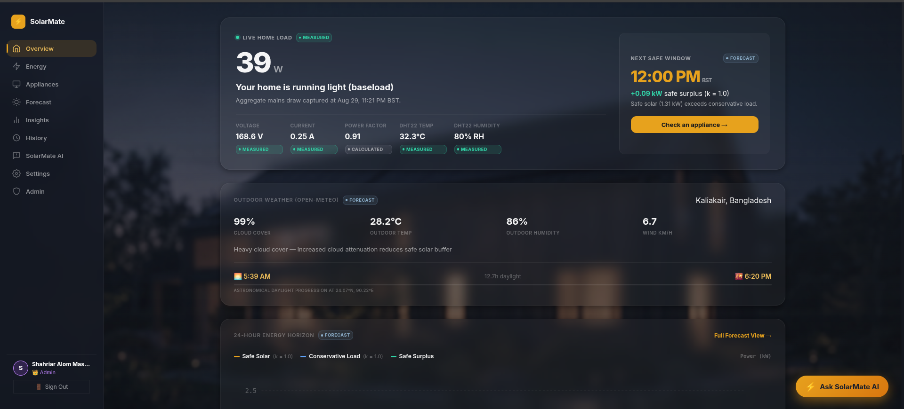
*Figure 1: Main Solar-Aware HEMS Web Interface featuring real-time solar generation, household load metrics, net grid draw, weather forecast telemetry, and physical source allocation state.*

### 2. Multi-Horizon Forecast Horizon & Uncertainty Envelopes
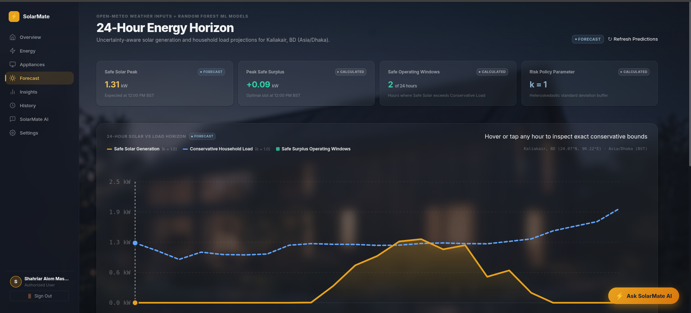
*Figure 2: 24-hour ahead predictive horizon comparing ML point forecasts with conservative risk-adjusted lower-bound solar generation and upper-bound load expectations.*

### 3. Dual-Layer Explainable AI (TreeSHAP Feature Attributions)
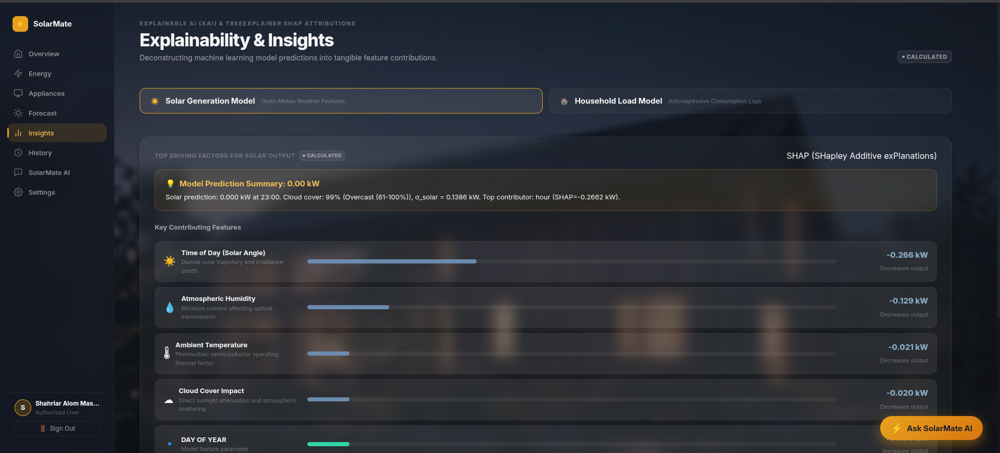
*Figure 3: Global and local TreeSHAP feature attribution rankings providing interpretability and physical auditability for predictive ML outputs.*

### 4. Risk-Aware 24-Hour Appliance Scheduling Timeline
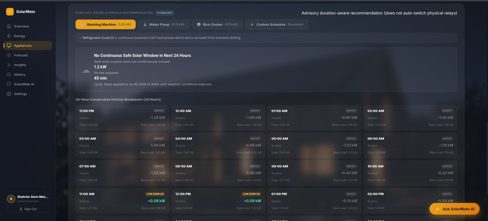
*Figure 4: Automated 24-hour appliance dispatch timeline computing safe solar surplus windows to prevent unexpected utility grid deficits.*

### 5. Embedded Hardware Prototype & Physical Silicon Testbed
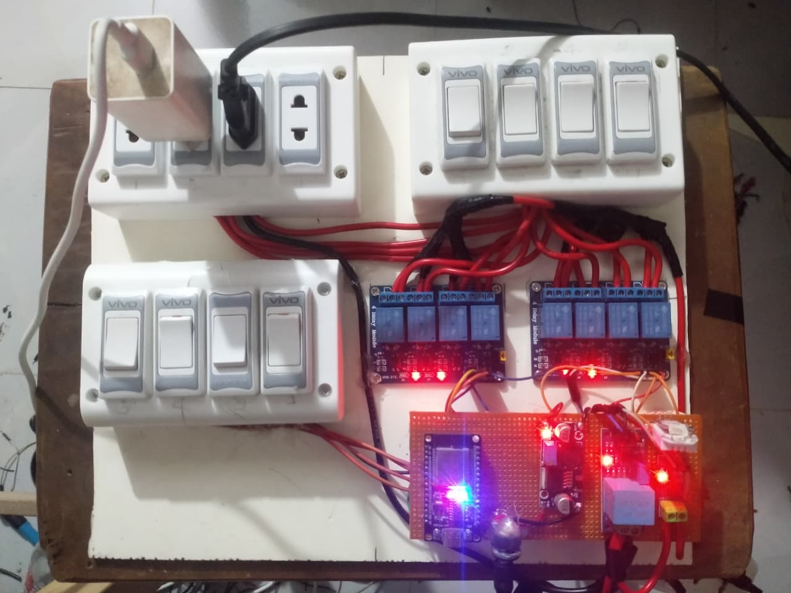
*Figure 5: Physical Cyber-Physical testbed featuring ESP32 FreeRTOS core, high-speed AC voltage/current sampling stage, and 8-channel dual-bank relay matrix with 300 ms break-before-make interlocks.*

---

## Table of Contents

1. [Key Features](#1-key-features)
2. [Master System Architecture](#2-master-system-architecture)
3. [How the System Works (Operational Pipeline)](#3-how-the-system-works-operational-pipeline)
   - [Solar Generation Forecasting](#solar-generation-forecasting)
   - [Residential Load Forecasting](#residential-load-forecasting)
   - [Risk-Aware Uncertainty Formulation](#risk-aware-uncertainty-formulation)
   - [Appliance Dispatch & Feasibility Logic](#appliance-dispatch--feasibility-logic)
   - [Explainable AI (TreeSHAP Attributions)](#explainable-ai-treeshap-attributions)
4. [Research Methodology & Technical Highlights](#4-research-methodology--technical-highlights)
5. [Dataset Provenance & Critical Academic Disclosures](#5-dataset-provenance--critical-academic-disclosures)
6. [Embedded Hardware Layer (ESP32 IoT & AC Sensing)](#6-embedded-hardware-layer-esp32-iot--ac-sensing)
7. [Installation & Local Setup Guide](#7-installation--local-setup-guide)
8. [Testing & Verification Status](#8-testing--verification-status)
9. [Project & Repository Structure](#9-project--repository-structure)
10. [Deployment Architecture (Render & Vercel)](#10-deployment-architecture-render--vercel)
11. [Limitations & Future Work](#11-limitations--future-work)
12. [Research & Cyber-Physical Disclaimer](#12-research--cyber-physical-disclaimer)
13. [Complete Visual Demonstration Gallery (All 25 Assets)](#13-complete-visual-demonstration-gallery-all-25-assets)
14. [Author & Contact Information](#14-author--contact-information)

---

## 1. Key Features

- **Multi-Horizon ML Forecasting:** Out-of-sample chronological forecasting of PV generation ($R^2 = 0.9547$) and residential aggregate load ($R^2 = 0.5929$) free of future lookahead or target leakage.
- **Dynamic $k \times \sigma$ Risk Engine:** Converts point forecasts into lower-bound solar generation and upper-bound load expectations, guaranteeing zero-deficit dispatch windows under an empirical $k=1.0$ operating point.
- **Dual-Layer Explainable AI (XAI):** Real-time TreeSHAP attribution delivering instant global feature rankings and local waterfall breakdowns for every prediction.
- **Dual-Core FreeRTOS Embedded Controller:** ESP32 firmware running 1 kHz true-RMS AC voltage/current sampling on Core 1 while managing Wi-Fi, HTTP telemetry streaming, and polling on Core 0.
- **Hardware Break-Before-Make Interlocks:** Enforces a 300 ms dead-time between Grid and Solar relay transitions to prevent catastrophic phase short-circuits.
- **SmartProv Captive-Portal Wi-Fi Provisioning:** Onboards new Wi-Fi credentials via SoftAP captive portal and encrypted NVS storage without hardcoded credentials.
- **Conversational AI & Explanation Layer (SolarMate AI):** Natural language conversational assistant powered by Groq LLM with function-calling capabilities over live telemetry, ML forecasts, and energy accounting. **Safety Architecture:** The assistant operates strictly as an advisory and explanation interface; the system architecture prevents LLM-generated responses or tool calls from directly controlling hardware or overriding the deterministic $k \times \sigma$ safety engine.
- **Enterprise Access Control:** Supabase PostgreSQL persistence with Role-Based Access Control (RBAC) and an Admin Approval Matrix.

---

## 2. Master System Architecture

```
┌─────────────────────────────────────────────────────────────────────────────────────────────────┐
│                                       MASTER SYSTEM TOPOLOGY                                    │
│                                                                                                 │
│  [ Open-Meteo Weather API ] ─┐                                                                  │
│                              ▼                                                                  │
│  [ Datasets / ML Models ] ──► [ ML Forecasting Engine ] ──► [ $k \times \sigma$ Risk Engine ]   │
│                                      │                                  │                       │
│                                      ▼                                  ▼                       │
│                              [ TreeSHAP XAI ]                 [ Safe Surplus Windows ]          │
│                                      │                                  │                       │
│                                      └────────────────┬─────────────────┘                       │
│                                                       ▼                                         │
│                                        ┌─────────────────────────────┐                          │
│                                        │     FastAPI Cloud Engine    │                          │
│                                        │  • REST Endpoints / Decision│                          │
│                                        │  • Groq SolarMate AI Agent  │                          │
│                                        └──────────────┬──────────────┘                          │
│                                                       │                                         │
│                      ┌────────────────────────────────┴────────────────────────────────┐        │
│                      ▼                                                                 ▼        │
│        ┌───────────────────────────┐                                     ┌─────────────────────┐│
│        │  React 19 + Vite Frontend │                                     │  Supabase Cloud DB  ││
│        │  • Live Power Gauge Strip │                                     │  • Telemetry Stream ││
│        │  • Forecast Horizons      │                                     │  • User RBAC & Auth ││
│        │  • Appliance Scheduling   │                                     │  • Decision Logs    ││
│        │  • XAI Waterfall Attrib.  │                                     └─────────────────────┘│
│        └─────────────┬─────────────┘                                                            │
│                      │                                                                          │
│                      ▼                                                                          │
│        ┌─────────────────────────────────────────────────────────────┐                          │
│        │                 ESP32 Cyber-Physical Layer                  │                          │
│        │  • Core 1: 1 kHz True-RMS AC Sampling (ZMPT101B + ACS712)   │                          │
│        │  • Core 0: Wi-Fi Telemetry Ingestion & Polling Loop         │                          │
│        │  • 8-Relay Matrix (4 Grid / 4 Solar with 300 ms Dead-Time)  │                          │
│        │  • SmartProv Captive Portal SoftAP Wi-Fi Provisioning       │                          │
│        └─────────────────────────────────────────────────────────────┘                          │
└─────────────────────────────────────────────────────────────────────────────────────────────────┘
```

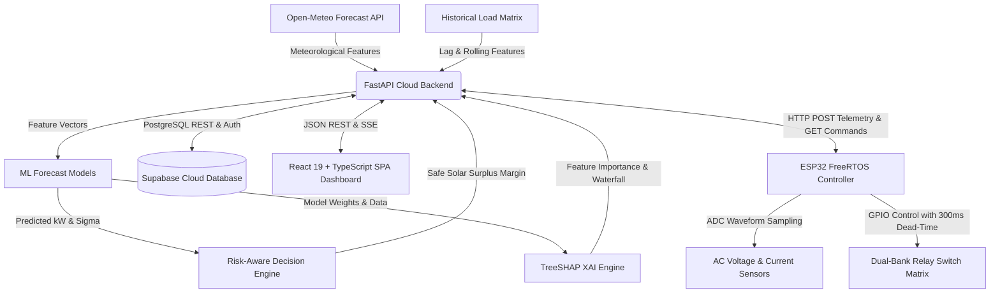
```mermaid
graph TD
    A[Open-Meteo Forecast API] -->|Meteorological Features| B(FastAPI Cloud Backend)
    C[Historical Load Matrix] -->|Lag & Rolling Features| B
    B -->|Feature Vectors| D[ML Forecast Models]
    D -->|Predicted kW & Sigma| E[Risk-Aware Decision Engine]
    D -->|Model Weights & Data| F[TreeSHAP XAI Engine]
    E -->|Safe Solar Surplus Margin| B
    F -->|Feature Importance & Waterfall| B
    B <-->|PostgreSQL REST & Auth| G[(Supabase Cloud Database)]
    B <-->|JSON REST & SSE| H[React 19 + TypeScript SPA Dashboard]
    B <-->|HTTP POST Telemetry & GET Commands| I[ESP32 FreeRTOS Controller]
    I -->|ADC Waveform Sampling| J[AC Voltage & Current Sensors]
    I -->|GPIO Control with 300ms Dead-Time| K[Dual-Bank Relay Switch Matrix]
```

### 2.1 Advisory Conversational Layer & Deterministic Safety Boundary

The architecture enforces a strict decoupling between natural language interaction and physical system actuation:

- **Deterministic Safety-Critical Core:** Appliance dispatch feasibility (`ALLOW` / `DENY`), conservative risk margins ($k \times \sigma$), TreeSHAP explanations, and hardware break-before-make relay dead-times ($300\text{ ms}$) are computed deterministically. They execute independently of the conversational LLM.
- **Advisory SolarMate AI Layer:** The conversational assistant uses structured, read-only tool definitions (`get_live_telemetry`, `get_solar_forecast`, `check_appliance_safety`, etc.) to query system state and explain recommendations. The backend architecture prevents LLM responses or tool calls from directly actuating physical relays or overriding safety decisions. Physical source switching remains strictly under human operator control or verified deterministic firmware routines.

## 3. How the System Works (Operational Pipeline)

```
Weather & Lag Inputs ──► ML Forecasting ──► Uncertainty Quantification ──► Risk-Aware Surplus ──► Relay Matrix Control
```

### 3.1 Solar Generation Forecasting
The solar forecasting pipeline estimates future photovoltaic power output ($\hat{S}$) using 7 meteorological and calendar inputs:
$$\hat{S} = f_{\text{solar}}(\text{cloud\_cover}, \text{temperature}, \text{humidity}, \text{wind\_speed}, \text{hour}, \text{month}, \text{day\_of\_year})$$
Physical domain constraints ensure solar power is non-negative and strictly zero when the sun is below the horizon.

### 3.2 Residential Load Forecasting
The residential load forecasting pipeline predicts total household demand ($\hat{L}$) using 16 historical lag, rolling statistical, and calendar features:
$$\hat{L} = f_{\text{load}}(P_{t-1}, P_{t-2}, P_{t-3}, P_{t-12}, P_{t-24}, P_{t-48}, P_{t-168}, \mu_{3h}, \mu_{24h}, \sigma_{24h}, \mu_{168h}, \text{hour}, \text{day\_of\_week}, \text{month}, \text{is\_weekend}, T_{2M})$$
When real-time high-resolution historical lags are unavailable during cold starts, the system gracefully utilizes conditional expectation benchmark fallback profiles:
$$\mathbb{E}[P_{\text{load}} \mid \text{month}, \text{day\_of\_week}, \text{hour}]$$

### 3.3 Risk-Aware Uncertainty Formulation
Standard ML models provide only mean point forecasts ($\mathbb{E}[Y \mid X]$), which fail during sudden cloud cover spikes or unpredicted load surges. Solar-Aware HEMS introduces a **dynamic risk-adjusted safety margin**:

$$\text{Safe Solar } (\hat{S}_{\text{safe}}) = \max(0, \hat{S} - k \cdot \sigma_{\text{solar}}(\text{cloud\_bucket}))$$

$$\text{Conservative Load } (\hat{L}_{\text{cons}}) = \hat{L} + k \cdot \sigma_{\text{load}}(\text{hour\_bucket})$$

$$\text{Safe Solar Surplus } (\text{Surplus}_{\text{safe}}) = \hat{S}_{\text{safe}} - \hat{L}_{\text{cons}}$$

Where $k=1.0$ is the empirically selected operating point providing robust coverage across backtested residual distributions.

#### Calibrated Uncertainty Dispersion Buckets ($\sigma$)
- **Solar Residual Buckets:**
  - Clear Sky ($0\text{--}20\%$ Cloud Cover): $\sigma = 0.0851\text{ kW}$
  - Partly Cloudy ($21\text{--}60\%$ Cloud Cover): $\sigma = 0.1317\text{ kW}$
  - Overcast ($61\text{--}100\%$ Cloud Cover): $\sigma = 0.1386\text{ kW}$
- **Load Residual Buckets:**
  - Night ($00:00\text{--}05:00$): $\sigma = 0.2662\text{ kW}$
  - Morning ($06:00\text{--}11:00$): $\sigma = 0.4800\text{ kW}$
  - Afternoon ($12:00\text{--}17:00$): $\sigma = 0.5114\text{ kW}$
  - Evening ($18:00\text{--}23:00$): $\sigma = 0.6075\text{ kW}$

### 3.4 Appliance Dispatch & Feasibility Logic
- **Instantaneous Feasibility Check (§8.1):**
  $$\text{Surplus}_{\text{safe}} \ge P_{\text{appliance}} \implies \text{ALLOW (Route to Solar)}, \quad \text{otherwise DENY (Route to Grid)}$$
- **Duration-Aware Multi-Hour Window Check (§8.2):**
  For an appliance running for duration $D$ hours starting at $t_0$:
  $$\min_{t \in [t_0, t_0 + D - 1]} \text{Surplus}_{\text{safe}}(t) \ge P_{\text{appliance}} \implies \text{ALLOW}$$

### 3.5 Explainable AI (TreeSHAP Attributions)
The system decomposes every point forecast into additive feature attribution components using TreeSHAP:
$$f(x) = E[f(x)] + \sum_{i=1}^{M} \phi_i(x)$$
Where $E[f(x)]$ is the base value and $\phi_i(x)$ is the SHAP contribution of feature $i$, enabling homeowners to understand exactly why a given surplus was predicted.

---

## 4. Research Methodology & Technical Highlights

### Rigorous Chronological Train/Test Partitioning
To prevent artificial inflation of accuracy from data leakage, all datasets were split strictly chronologically:
- **Solar Model Split:** Train (2020–2024, 80%), Test (2025–2026, 20%).
- **Load Model Split:** Train (2006–2009, 80%), Test (2010, 20%).

### Comprehensive Model Benchmark Comparison

| Pipeline | Model Architecture | Test $R^2$ | Test RMSE (kW) | Test MAE (kW) | Operational Role |
| :--- | :--- | :---: | :---: | :---: | :--- |
| **Solar Generation** | **Random Forest (`rf_corrected.joblib`)** | **0.9547** | **0.1264** | **0.0617** | **Primary Scientific Benchmark** |
| Solar Generation | **XGBoost (`xgboost_corrected.joblib`)** | **0.9507** | **0.1319** | **0.0673** | **Cloud Free-Tier Production Engine** |
| Solar Generation | Decision Tree | 0.9329 | 0.1539 | 0.0766 | Fast Edge / Local Baseline |
| Solar Generation | Support Vector Regression (SVR) | 0.9416 | 0.1436 | 0.0772 | Non-linear Comparative Model |
| Solar Generation | Linear Regression | 0.7303 | 0.3108 | 0.2291 | Linear Benchmark |
| **Residential Load** | **Random Forest (`rf_corrected.joblib`)** | **0.5929** | **0.4908** | **0.3150** | **Primary Scientific Benchmark** |
| Residential Load | **XGBoost (`xgboost_corrected.joblib`)** | **0.5694** | **0.5048** | **0.3341** | **Cloud Free-Tier Production Engine** |
| Residential Load | Decision Tree | 0.4475 | 0.5721 | 0.3693 | Fast Edge / Local Baseline |
| Residential Load | Support Vector Regression (SVR) | 0.5401 | 0.5216 | 0.3332 | Non-linear Comparative Model |
| Residential Load | Linear Regression | 0.5422 | 0.5204 | 0.3601 | Linear Benchmark |

---

## 5. Dataset Provenance & Critical Academic Disclosures

> [!IMPORTANT]
> **Mandatory Scientific Disclosure on Spatial and Temporal Independence:**
> 1. **Residential Load Dataset:** Sourced from the *UCI Machine Learning Repository: Individual Household Electric Power Consumption* dataset, recorded in Sceaux, France (2006–2010) at 1-minute resolution (aggregated to 1-hour intervals).
> 2. **Solar Generation Dataset:** Derived from ERA5 Reanalysis meteorological telemetry via the *Open-Meteo Historical Weather API* for Kaliakair, Gazipur, Bangladesh ($24.07^\circ\text{N}, 90.22^\circ\text{E}$) spanning 2020–2026.
> 3. **Non-Colocation Acknowledgment:** These two datasets are **not geographically or temporally co-located**. They represent two independent, authoritative benchmark domains for validating machine learning forecasting pipelines, uncertainty bounds, and cyber-physical relay switching logic.
> 4. **No Matched-Household Claims:** This work does not claim that the load and solar data represent a single physical household. The cyber-physical system coordinates these models through synthetic alignment matrices and real-time physical bench telemetry to prove end-to-end operational feasibility.

---

## 6. Embedded Hardware Layer (ESP32 IoT & AC Sensing)

### Dual-Bank Relay Matrix Circuit Architecture
To enable independent power routing for up to 4 appliances, the hardware architecture implements an 8-channel relay matrix grouped into two electrical banks:
- **Bank A (Relays 1–4):** Utility Grid Phase Connection (230 V AC / 50 Hz).
- **Bank B (Relays 5–8):** Represented Solar Inverter Phase Connection.

```
AC Grid (230V)  ──► [ Bank A: Relay 1 ] ──┐
                                          ├──► [ Appliance 1 Load ] (Current Sensor ACS712)
Solar AC Line   ──► [ Bank B: Relay 5 ] ──┘
                    (300ms Dead-Time Break-Before-Make Protection)
```

### Safety Interlocks & Hardware Protections
- **Break-Before-Make Switching:** Firmware strictly enforces a **300 ms dead-time** when transferring any appliance between Grid and Solar sources, preventing direct short-circuits between unsynchronized AC phases.
- **Anti-Chattering Timer:** A minimum hold duration (60 seconds) prevents relay contacts from rapid thermal oscillation during marginal solar conditions.
- **Active-LOW Fail-Safe Logic:** In the event of an ESP32 power outage or reset, all relay coils de-energize to the normally open (NO) fail-safe state.

### High-Frequency AC Sensing & Calibration Validation
- **Microcontroller Core 1 Sampling:** The ESP32 executes an unthrottled synchronized sampling loop ($1.5\text{–}2.0\text{ kHz}$) across a $200\text{ ms}$ window (10 complete $50\text{ Hz}$ AC cycles), capturing $300\text{–}400$ dual-channel sample pairs for ZMPT101B voltage and ACS712-20A current.
- **Direct Measured Evidence:** Physical bench multimeter reference measurements recorded mains voltage $V \approx 226.0\text{ V AC RMS}$ and load current $I \approx 0.28\text{ A AC RMS}$ for a connected Walton WTF9M3 table fan (manufacturer nameplate rated active power $60\text{ W}$). Calculated bench apparent power is $S = 63.28\text{ VA}$. Power factor is unmeasured.
- **Voltage Calibration Accuracy:** Calibrated scaling factor $K_V = 0.619060\text{ V/count}$ achieved live ESP32 telemetry reading $V_{\text{ESP32}} = 228.16\text{ V}$ ($1.40\%$ error relative to the $225.00\text{ V}$ calibration reference; $0.96\%$ error relative to the later $\approx 226\text{ V}$ validation observation). Measured quiescent zero offsets ($V_{\text{zero}} = 2539.65, I_{\text{zero}} = 2537.18$) are persisted in NVS flash namespace `"hems_cal"`.
- **Quantization Disclosure:** The ACS712-20A sensor with a $10\text{k}\Omega / 15\text{k}\Omega$ passive divider provides a 12-bit ADC quantization step of $13.43\text{ mA/count}$. Sub-ampere appliances ($0.28\text{ A}$) operate with an ADC swing of $\approx \pm 29.5\text{ counts}$, confirming that low-power residential appliances operate in the low-quantization region of a 20A Hall sensor.

### SmartProv Captive-Portal Wi-Fi Provisioning
The firmware eliminates hardcoded Wi-Fi credentials via SmartProv:
1. If Wi-Fi connection fails or the BOOT button is held for 3 seconds, ESP32 initializes an access point (`HEMS_XXXX`).
2. A DNS captive portal automatically directs the user's mobile browser to `192.168.4.1`.
3. The user inputs their local Wi-Fi SSID and Password.
4. Credentials are encrypted and saved to ESP32 Non-Volatile Storage (NVS), followed by automatic reconnection.

---

## 7. Installation & Local Setup Guide

### Prerequisites
- **Python 3.11+**
- **Node.js 18+ & npm**
- **Arduino IDE 2.x** or PlatformIO (for ESP32 flashing)

### Step 1: Clone Repository
```bash
git clone https://github.com/Masud744/solar-aware-hems.git
cd solar-aware-hems
```

### Step 2: Backend Setup
```bash
cd backend
python3 -m venv .venv
source .venv/bin/activate
pip install --upgrade pip
pip install -r requirements.txt

# Configure environment variables (NEVER commit actual secret keys)
cp .env.example .env
```
Edit `backend/.env` with your Supabase credentials:
```env
SUPABASE_URL=https://your-project.supabase.co
SUPABASE_SERVICE_ROLE_KEY=your-service-role-secret-key
SAFETY_K=1.0
GROQ_API_KEY=your-groq-api-key
GROQ_MODEL=llama-3.3-70b-versatile
```

### Step 3: Frontend Setup
```bash
cd ../frontend
npm install
cp .env.example .env
```
Edit `frontend/.env`:
```env
VITE_API_BASE_URL=http://127.0.0.1:8000
```

### Step 4: Run Locally
- **Start Backend:**
  ```bash
  cd backend
  uvicorn app.main:app --host 127.0.0.1 --port 8000 --reload
  ```
- **Start Frontend:**
  ```bash
  cd frontend
  npm run dev
  ```
- Access Dashboard at `http://localhost:5173`.

---

## 8. Testing & Verification Status

The entire codebase is validated with an automated test suite spanning backend prediction services, risk calculation math, Supabase RBAC access controls, firmware telemetry parsing, and state synchronization:

```bash
# Run complete test suite (46 Tests)
SOLAR_MODEL_PATH=ml/solar/models/xgboost_corrected.joblib \
LOAD_MODEL_PATH=ml/load/models/xgboost_corrected.joblib \
pytest -v backend/tests firmware/tests
```

**Verification Results:**
```text
============================= test session starts ==============================
platform linux -- Python 3.14.4, pytest-9.0.2
rootdir: /path/to/solar-aware-hems
collected 46 items

backend/tests/test_assistant_chat.py::test_tool_get_live_telemetry PASSED
backend/tests/test_assistant_chat.py::test_tool_appliance_safety_allow PASSED
backend/tests/test_auth_and_admin.py::test_signup_creates_pending_user PASSED
backend/tests/test_auth_and_admin.py::test_login_approved_user_receives_token PASSED
backend/tests/test_decision_engine.py::TestSection83WorkedExample::test_exact_intermediate_values PASSED
backend/tests/test_energy_accounting.py::test_trapezoidal_integration_basic PASSED
backend/tests/test_firmware_v2_endpoints.py::test_calibrated_telemetry_ingest PASSED
backend/tests/test_state_synchronization.py::test_pending_command_protected_from_old_telemetry PASSED
firmware/tests/test_firmware_math.py::test_pure_resistive_load PASSED
firmware/tests/test_firmware_math.py::test_acs712_resistor_divider_voltage_safety PASSED
======================== 46 passed, 1 warning in 0.78s =========================
```

---

## 9. Project & Repository Structure

```
solar-aware-hems/
├── backend/                        # FastAPI Cloud Service
│   ├── app/
│   │   ├── config.py               # Pydantic environment configuration
│   │   ├── database.py             # Supabase PostgreSQL client
│   │   ├── main.py                 # FastAPI application & CORS routing
│   │   ├── models/schemas.py       # Pydantic request/response schemas
│   │   ├── routers/                # REST endpoints (predict, risk, xai, chat, auth, etc.)
│   │   └── services/               # ML models, decision engine, weather, assistant
│   ├── requirements.txt            # Pinned backend dependencies
│   └── tests/                      # Automated unit & integration tests
├── frontend/                       # React 19 + TypeScript + Vite SPA
│   ├── src/
│   │   ├── api/                    # API client & 30-min forecast caching service
│   │   ├── components/             # UI components (Gauges, Forecasts, XAI, Assistant)
│   │   ├── hooks/                  # Custom React hooks (useTelemetry, useForecast)
│   │   └── types/                  # TypeScript interface definitions
│   └── vercel.json                 # Vercel SPA rewrite routing
├── firmware/                       # ESP32 C++ Microcontroller Firmware
│   ├── firmware.ino                # FreeRTOS dual-core tasks & sampling loops
│   ├── config.h                    # Pin assignments & hardware constants
│   ├── SmartProv.h / .cpp          # SoftAP captive-portal Wi-Fi onboarding
│   └── tests/                      # AC sampling & sensor division math unit tests
├── ml/                             # Machine Learning & Uncertainty Pipelines
│   ├── solar/                      # Solar forecasting scripts, models & plots
│   ├── load/                       # Load forecasting scripts, models & plots
│   ├── risk_module/                # $k \times \sigma$ uncertainty quantification & coverage
│   └── xai/                        # TreeSHAP explainability scripts & attribution plots
├── Dataset/                        # Raw Benchmark Datasets
│   ├── kaliakair_openmeteo_solar_raw.csv   # Solar weather telemetry (Bangladesh)
│   └── main_data.csv                       # UCI household electricity load (France)
├── Screenshoots/                   # 25 Complete Visual Demonstration Photographs
├── requirements.txt                # Root Python environment requirements
├── .gitignore                      # Security & artifact exclusions
└── README.md                       # Master Public Technical Showcase
```

---

## 10. Deployment Architecture (Render & Vercel)

### Backend Deployment (Render Free Web Service)
- **Environment:** Python 3
- **Root Directory:** `.` (Repository Root)
- **Build Command:** `pip install --upgrade pip && pip install -r backend/requirements.txt`
- **Start Command:** `uvicorn backend.app.main:app --host 0.0.0.0 --port $PORT`
- **Instance Plan:** Free Tier ($512\text{ MB}$ RAM)
- **Environment Variables (Render Dashboard):**
  - `SOLAR_MODEL_PATH`: `ml/solar/models/xgboost_corrected.joblib`
  - `LOAD_MODEL_PATH`: `ml/load/models/xgboost_corrected.joblib`
  - `SUPABASE_URL`: `https://<your-project>.supabase.co`
  - `SUPABASE_SERVICE_ROLE_KEY`: `<your-supabase-service-role-key>`
  - `SAFETY_K`: `1.0`
  - `GROQ_API_KEY`: `<your-groq-api-key>`
  - `GROQ_MODEL`: `llama-3.3-70b-versatile`
- **Operational RAM:** Measured **$250.43\text{ MB}$ RAM** during active inference, operating safely within the $512\text{ MB}$ limit.

### Frontend Deployment (Vercel Static Web App)
- **Framework Preset:** `Vite`
- **Root Directory:** `frontend`
- **Build Command:** `npm run build`
- **Output Directory:** `dist`
- **Environment Variable:** `VITE_API_BASE_URL` set to your live Render backend URL.

---

## 11. Limitations & Future Work

1. **Spatial & Temporal Co-Location:** Future iterations will collect co-located solar generation and multi-circuit residential consumption from a single physical deployment site in Bangladesh.
2. **Battery Storage (BESS) Integration:** Incorporating Battery Energy Storage System (BESS) state-of-charge (SoC) modeling into the dynamic $k \times \sigma$ optimization function.
3. **Multi-Agent Microgrid Trading:** Extending the single-home dispatch logic to peer-to-peer (P2P) neighborhood microgrid energy exchanges.

---

## 12. Research & Cyber-Physical Disclaimer

- **Measured vs. Predicted Values:** In the web dashboard and API responses, values labeled as *Telemetry* represent physical ADC sensor measurements from the ESP32 hardware. Values labeled as *Forecast* or *Prediction* represent ML outputs derived from Open-Meteo weather forecasts and historical load matrices.
- **Accounting Calculations:** Energy accumulation ($E = \int P \, dt$) uses standard trapezoidal numerical integration with a 15-minute gap threshold to prevent distortion during connectivity dropouts.

---

## 13. Complete Visual Demonstration Gallery (All 25 Assets)

### 13.1 System Overview & Real-Time Monitoring
| Hero & Outlook | Live Sensor Strip | Dynamic Energy Flow |
| :---: | :---: | :---: |
|  | 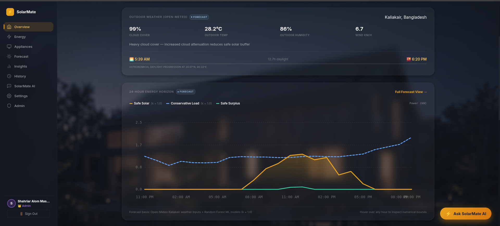 | 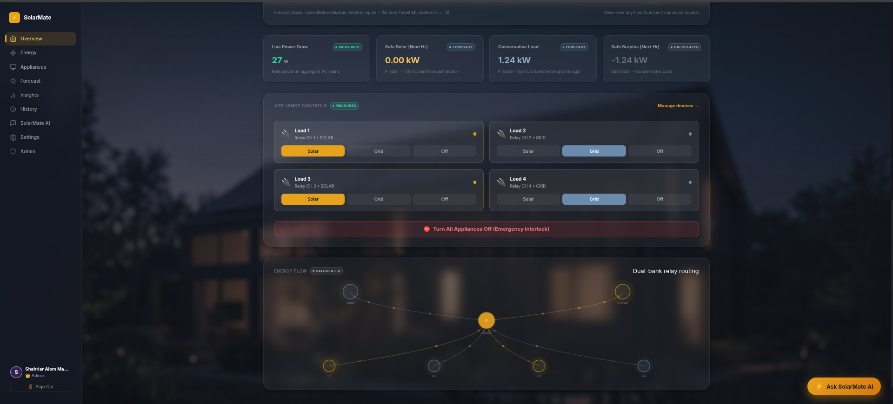 |
| *System status, quick forecast preview & source mix* | *Live AC voltage, frequency, load power & temp* | *Active electrical routing between Grid, Solar & Loads* |

### 13.2 Forecast Horizon & Uncertainty Envelopes
| 24-Hour Horizon Curves | Hourly Matrix & Uncertainty Table |
| :---: | :---: |
|  | 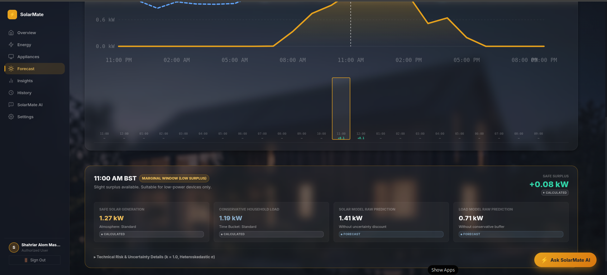 |
| *Predicted vs. Conservative Safe Bounds over 24h* | *Tabular breakdown of hourly $\sigma$, cloud buckets & safe surplus* |

### 13.3 Appliance Management & Risk Scheduling
| Preset Appliance Matrix | Custom Load Simulation | 24-Hour Schedule Timeline |
| :---: | :---: | :---: |
| 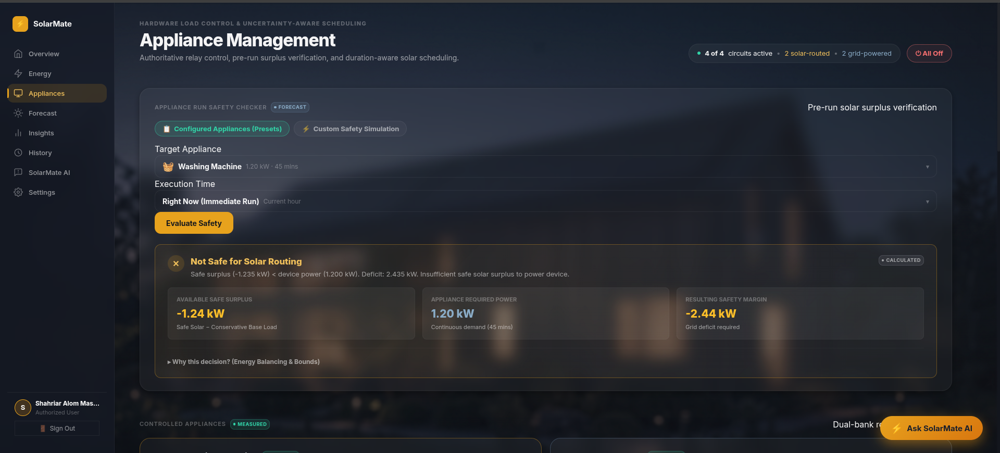 | 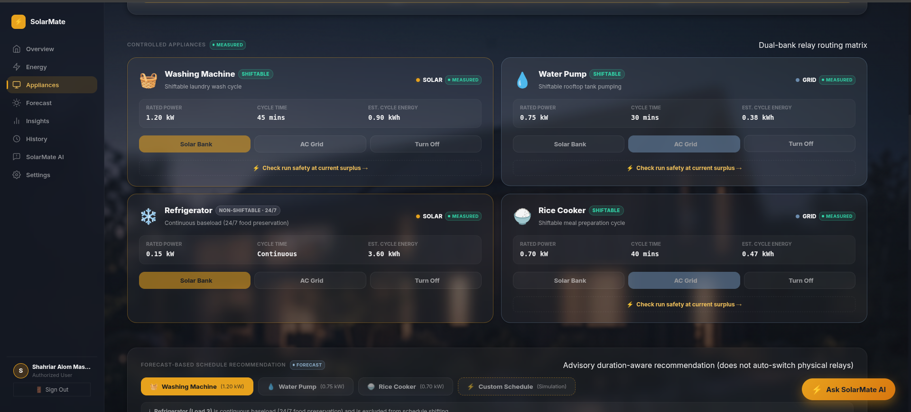 |  |
| *Direct Grid/Solar source selection switches* | *Interactive power/duration feasibility calculator* | *Optimal zero-deficit run window recommendations* |

### 13.4 Energy Accounting & Cost Optimization
| Trapezoidal Integration & Tariff Accounting |
| :---: |
| 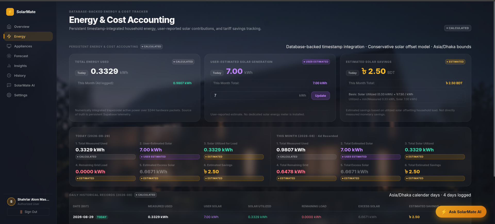 |
| *Cumulative solar generation, grid consumption, self-consumption percentage, and monetary tariff savings* |

### 13.5 Dual-Layer Explainable AI (XAI)
| Global Feature Importance Rankings | Local Waterfall Attributions |
| :---: | :---: |
|  | 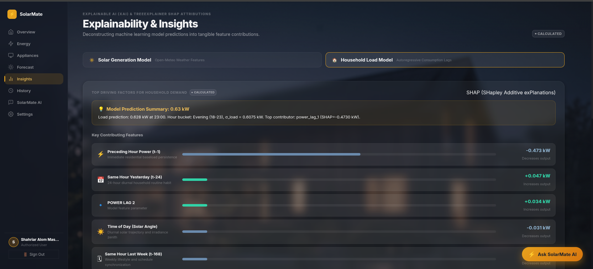 |
| *Top macroeconomic meteorological & lag feature rankings* | *Per-prediction TreeSHAP positive/negative force breakdowns* |

### 13.6 Conversational AI Assistant (SolarMate AI)
| Interactive HEMS Assistant Drawer |
| :---: |
| 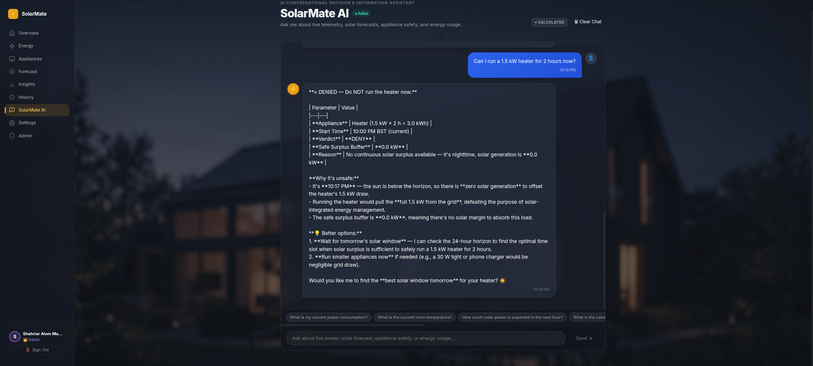 |
| *Natural language conversational agent with tool-calling capabilities over live telemetry and risk bounds* |

### 13.7 History, Analytics & Diagnostics
| Multi-Day Sensor Trends & History | System Settings & Tariff Configuration |
| :---: | :---: |
| 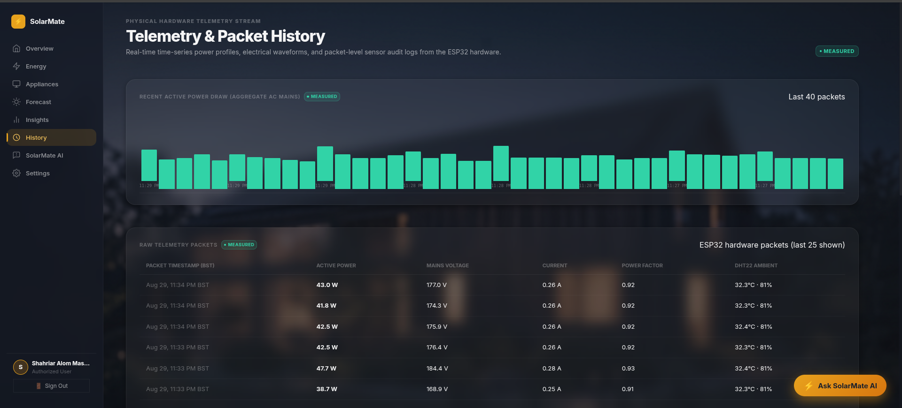 | 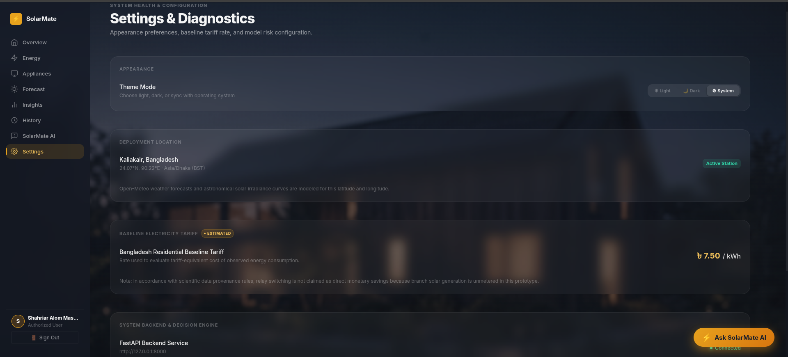 |
| *Historical time-series telemetry trends & source ratios* | *GPS coordinates, safety multiplier $k$, and electricity rates* |

### 13.8 Authentication, User Lifecycle & Admin Approval
| Login Portal | Registration Page | Password Reset | Verification Notice | Admin Approval Matrix |
| :---: | :---: | :---: | :---: | :---: |
| 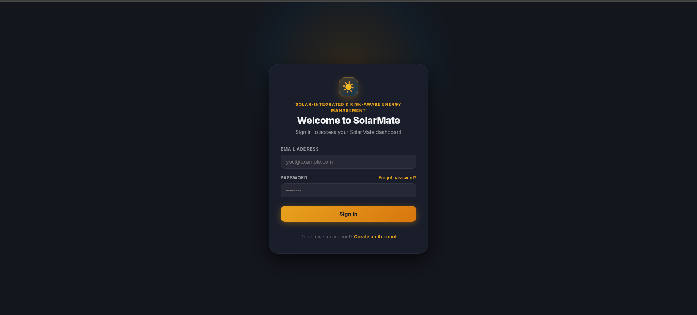 |  |  |  | 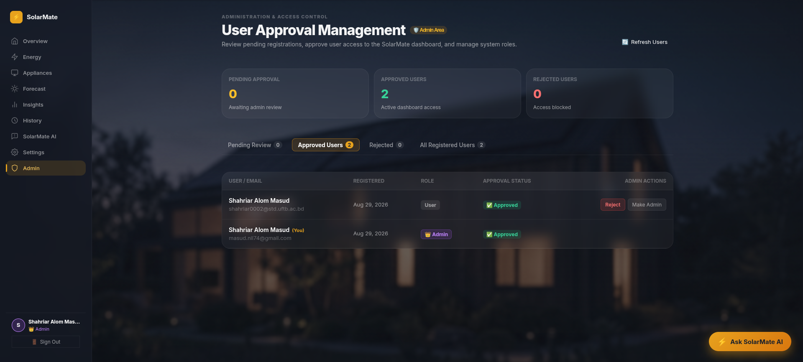 |
| *JWT Auth* | *Role-Based Sign-Up* | *Self-Service Reset* | *Verification Gate* | *Admin Approval Console* |

### 13.9 Database Architecture & Network Provisioning
| Supabase PostgreSQL Database Schema | SmartProv Mobile Captive Portal UI |
| :---: | :---: |
| 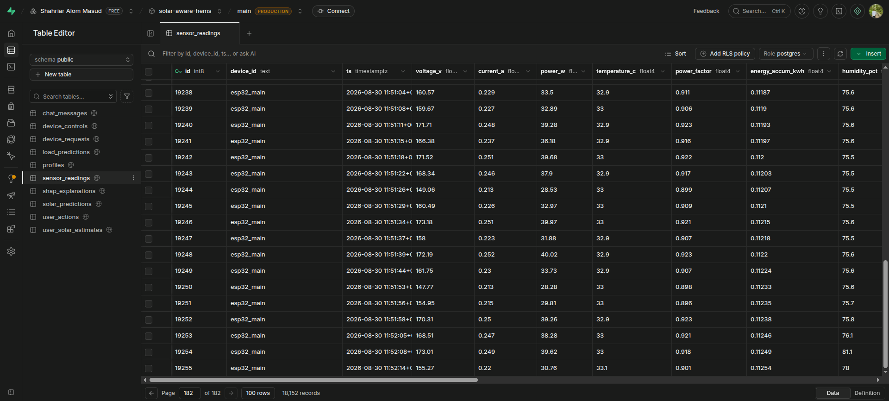 | 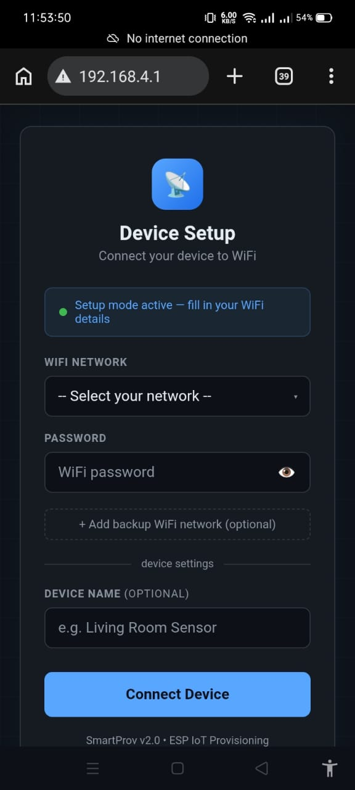 |
| *Relational tables for telemetry, predictions & audit logs* | *Mobile SoftAP captive portal onboarding without hardcoded credentials* |

### 13.10 Embedded Hardware Prototype & Physical Silicon Testbed
| Testbed Overview | AC Sensing Stage | Relay Matrix Bank | ESP32 Controller Core |
| :---: | :---: | :---: | :---: |
|  | 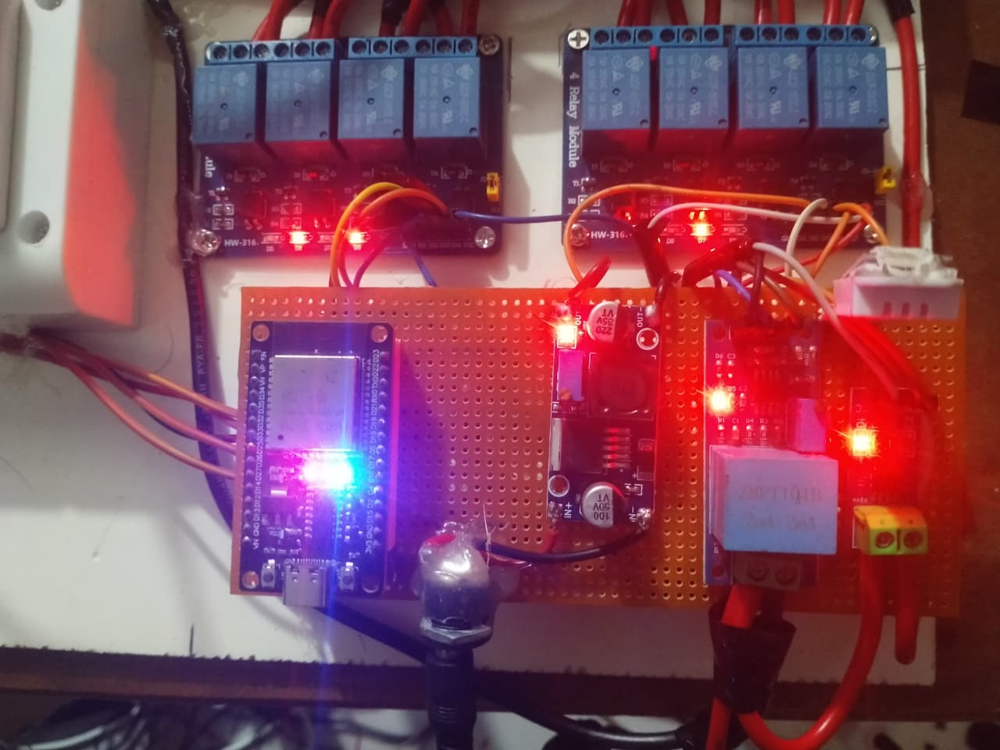 | 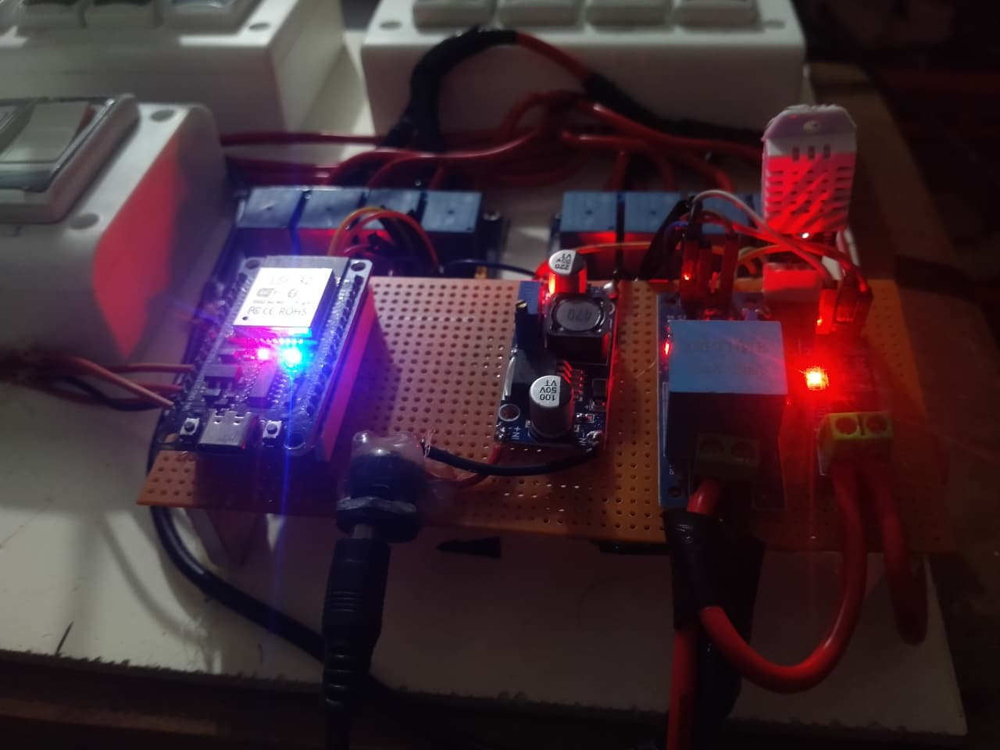 | 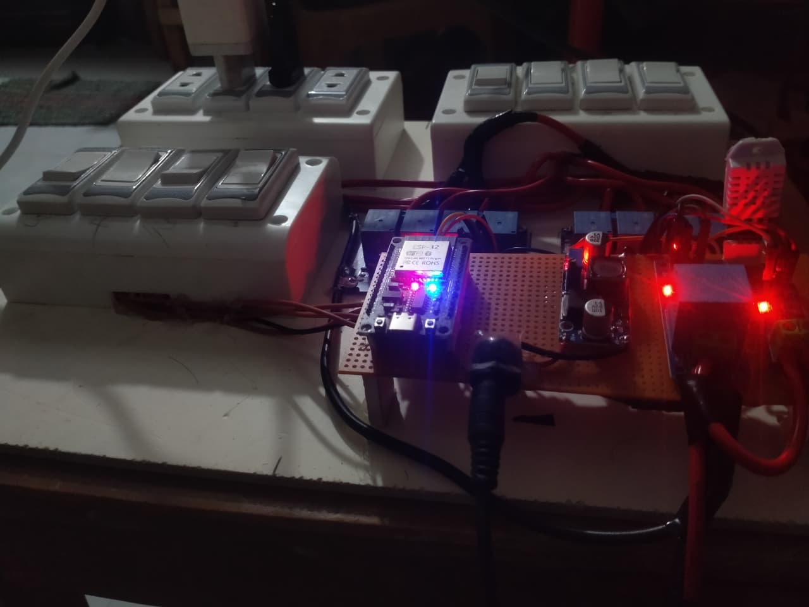 |
| *Complete physical bench setup* | *ZMPT101B & ACS712 sensors* | *8-channel dual-bank matrix* | *ESP32 FreeRTOS microcontroller* |

---

## 14. Author & Contact Information

**Shahriar Alom Masud**  
B.Sc. Engg. in IoT & Robotics Engineering  
University of Frontier Technology, Bangladesh  
- **Email:** [shahriar0002@std.uftb.ac.bd](mailto:shahriar0002@std.uftb.ac.bd)  
- **LinkedIn:** [https://www.linkedin.com/in/shahriar-alom-masud](https://www.linkedin.com/in/shahriar-alom-masud)  
- **GitHub:** [https://github.com/Masud744](https://github.com/Masud744)

---

## License

This project is licensed under the MIT License — see the [LICENSE](LICENSE) file for details.
